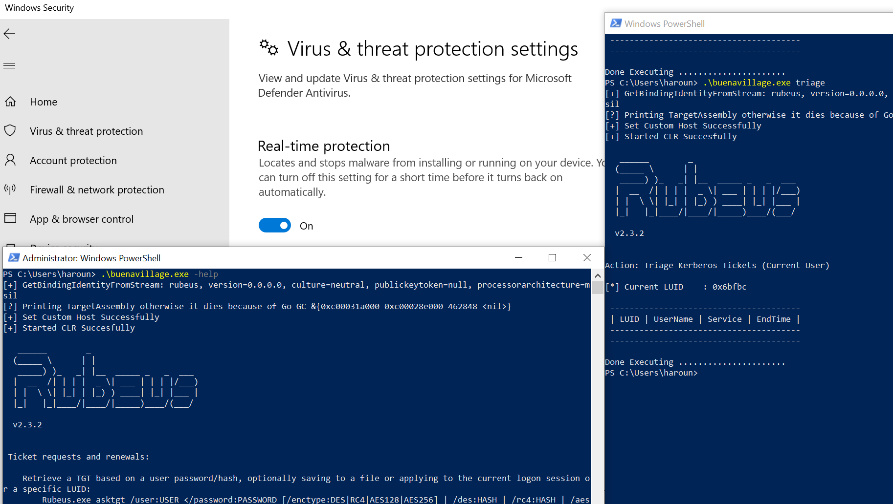

# Example Usage - Buena Village

This will use go to be a good CLR Host for the exe. It will

- Hide The malicious .NET via a simple XOR Decryption
- Start a Good CLR Host and load Assembly with Load2 - Natively bypassing AMSI

For example, to build this for Rubeus, cd into this directory and do:

```
go mod tidy
go run helper/helper.go -file=/home/kali/Desktop/goodclr/Rubeus.exe && GOOS=windows GOARCH=amd64 go build
```

The above command will generate an exe `buenavillage.exe` that you can use like the original `Rubeus.exe`. RUBEUS IS LIVING IN BUENA!!!



